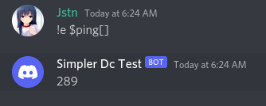

# $functionEval

## Usage:

\[text]

## Example:

```js
$send[$channelId[];$functionEval[$message[]]]
```

## Example Command:

```javascript
bot.command({
    name: "e",
    code: `$send[$channelId[];$functionEval[$message[]]]`
})
```

### Preview:




Eval is very sensitive, you should limit the users who want to use eval in your bot or better only you use it.

